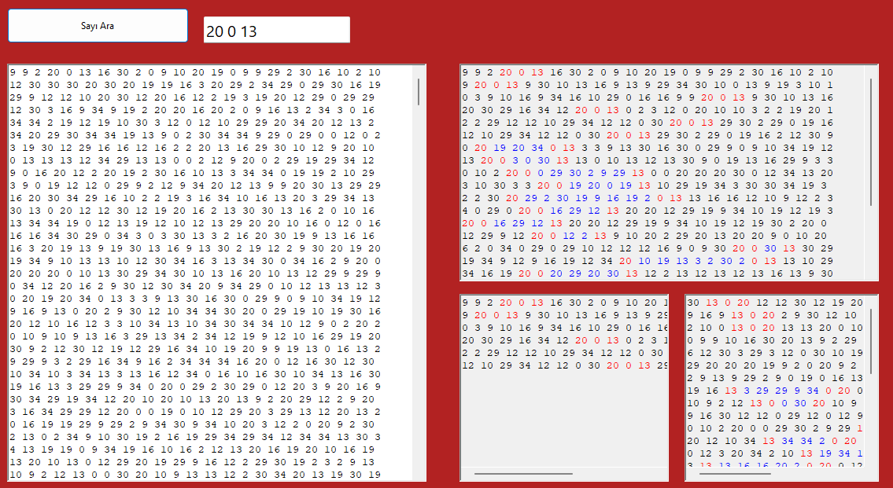

Project Description  
This Windows Forms application is designed to assist users in analyzing text to identify and understand patterns of numerical sequences. It offers the ability to detect both forward and reverse sequences of numbers input by the user, highlighting these sequences within the text for clear visibility. Additionally, the application can recognize and display gaps within these sequences, helping users to identify missing elements or anomalies.  

Key Features  
Numerical Sequence Detection: The application processes user-entered sequences of numbers and scans text to find these sequences exactly as entered or in reverse. 
Highlighting for Clarity: Found sequences are highlighted directly within the text—forward sequences in one color and sequences with gaps in another, making them stand out for easy analysis. 
Gap Analysis: It uniquely identifies gaps within the sequences, providing insights into missing numbers or breaks in patterns. 
Interactive Text Input: Users can interactively input and modify text and numbers, with immediate feedback and analysis results displayed in the application. 
Practical Uses 
This tool is especially useful for educational purposes, data entry verification, or any analytical tasks that involve pattern recognition in numerical data. It can be employed in academic research to analyze data integrity, in business settings to check sequential data entries, and in personal projects where pattern recognition can enhance data understanding.  

